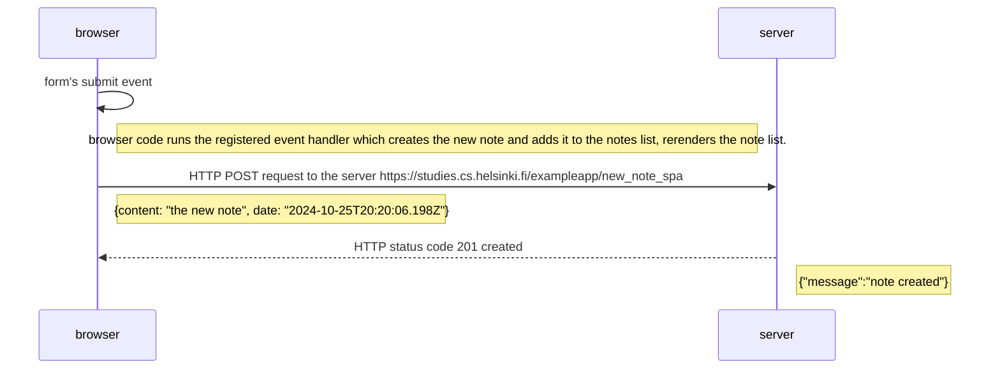

```mermaid
sequenceDiagram
    participant browser
    participant server

    browser->>browser: form's submit event
    Note right of browser: browser code runs the registered event handler which creates the new note and adds it to the notes list, rerenders the note list.

	browser->>server: HTTP POST request to the server https://studies.cs.helsinki.fi/exampleapp/new_note_spa
	Note right of browser: {content: "the new note", date: "2024-10-25T20:20:06.198Z"}
	server-->>browser: HTTP status code 201 created
	Note right of server: {"message":"note created"}
```
